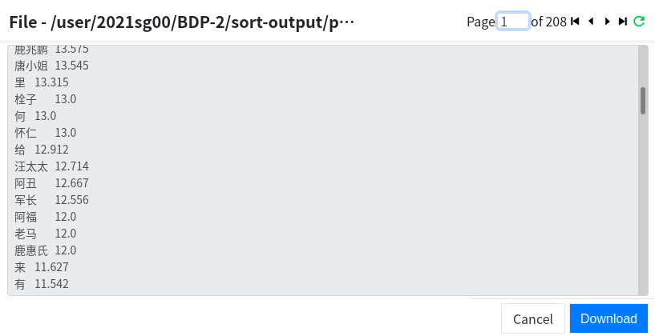
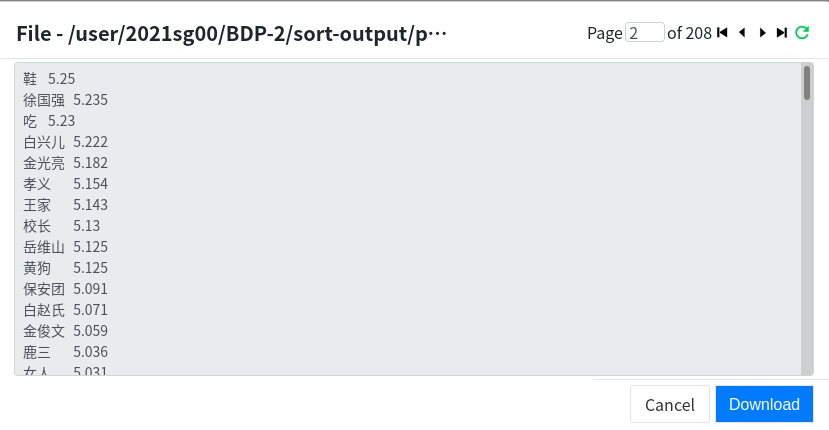
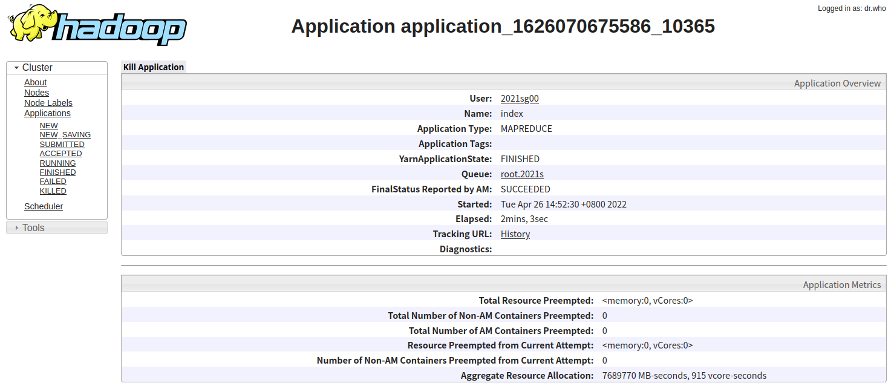
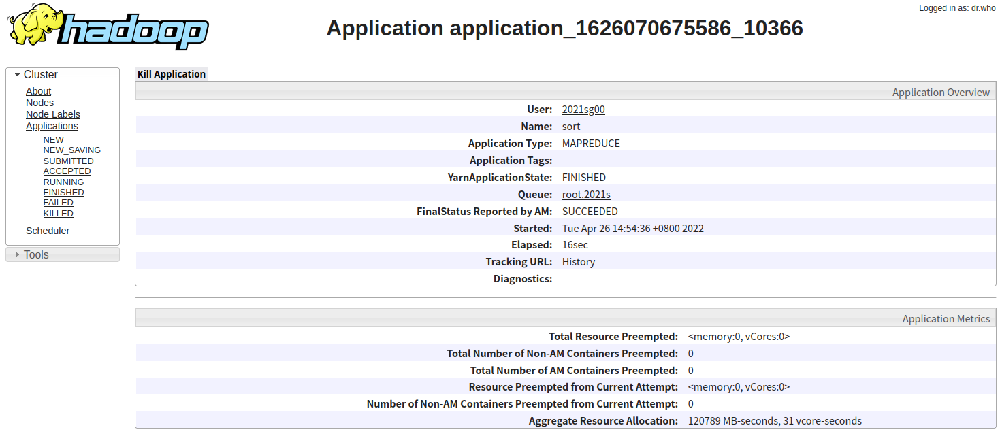
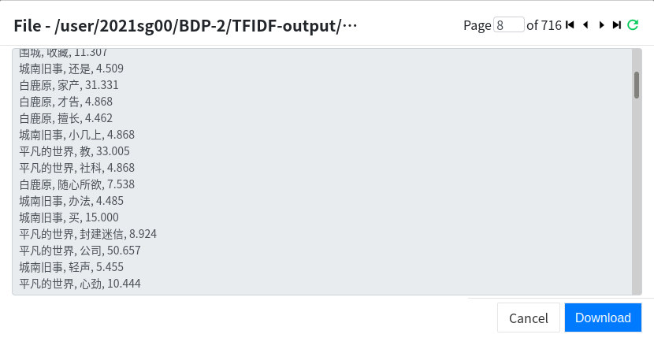
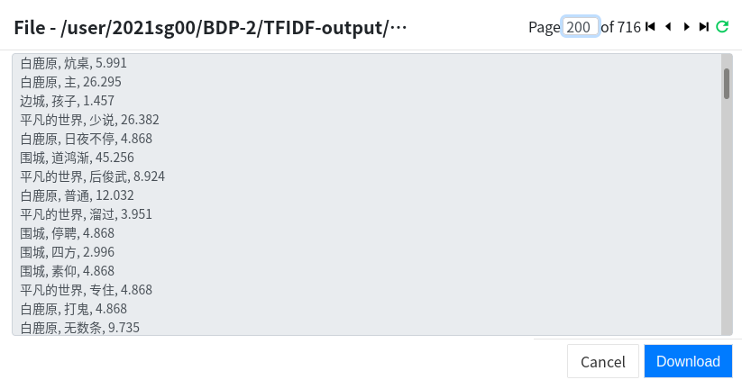
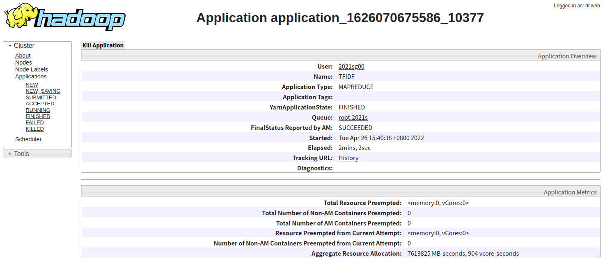

#### 选做内容

​	选做内容部分全部打包成为`lab2-pro.jar`，其执行方式为:

```bash
// 全局排序
hadoop jar lab2-pro.jar Sort <input> <temp> <output>
// TFIDF
hadoop jar lab2-pro.jar TFIDF <input> <output>
```

1.**全局排序**

(1).Map 和 Reduce 的设计思路

​	因为mapreduce本身具有将key排序的功能，是以只要交换键与内容，将其交予的内容(此处为每个词的平均出现次数)作为key进行排序，将key作为内容传递。最后输出时刻将二者倒置输出即可。(key， value)类型为(Text, FloatWritable)。

​	注意到在倒排索引任务中也要输出`词语 \TAB 平均出现次数（保留 3 位小数） 文档-1:词频; 文档-2:词频; …; 文档-n:词频`，所以将倒排索引任务的输出简单修改为`词语 \TAB 平均出现次数（保留 3 位小数）`，以此作为中间结果，而后Sort读取该中间结果进行排序。

​	换言之，本全局排序需要使用两个job，job1为简单修改后的倒排索引，job2为排序。job2依赖于job1以形成工作序列。

​	需要注意的是，mapreduce默认为升序排序，而现需要降序排序，故需要重写比较器Comparator以实现降序排序。

(2)Map 和 Reduce 的代码

​	此处仅给出Sort部分代码，倒排索引部分见上。同时给出了重写比较器Comparator部分。

​	此部分较为简单，调用的是mapreduce本身机制，故内容不多，见注释即可。

```java
    public static class SortMapper extends Mapper<Object, Text, FloatWritable, Text> {
        @Override
        // input:(tf, word) output:(tf, word)
        protected void map(Object key, Text value, Context context) throws IOException, InterruptedException {
            // 划分输入行
            String[] buffer = value.toString().split("\\t");
            // 传递(tf, word)
            context.write(new FloatWritable(Float.parseFloat(buffer[1])), new Text(buffer[0]));
        }
    }

    public static class SortReducer extends Reducer<FloatWritable, Text, Text, FloatWritable> {
        @Override
        // input:(word, tf) output:(tf, word)
        protected void reduce(FloatWritable key, Iterable<Text> values, Context context)
                throws IOException, InterruptedException {
            for (Text value : values) {
                context.write(value, key);
            }
        }
    }

    public static class FloatWritableComparator extends WritableComparator {

        // 重写构造方法，定义比较类 FloatWritable
        public FloatWritableComparator() {
            super(FloatWritable.class, true);
        }
        // 重写compare方法，自定义比较规则
        @Override
        public int compare(WritableComparable a, WritableComparable b) {
            //向下转型
            FloatWritable ia = (FloatWritable) a;
            FloatWritable ib = (FloatWritable) b;
            return ib.compareTo(ia);
        }
    }
```

(3)输出结果文件部分截图

​	输出文件在HDFS上的路径:`/user/2021sg00/BDP-2/sort-output`

​	下面给出部分截图:





(4)“我们”、“什么”两个单词的输出结果

```
我们	5.719

什么	8.723
```

(5)webUI 报告内容

​	此处有两项job，依次给出webUI报告截图，上为job1，下为job2:





2.**TFIDF**

(1).Map 和 Reduce 的设计思路

​	此处设计思路在于，需要计算出不同作品词语的频次即出现文件数由此计算TFIDF，因为作品名是文件名的字串，故(k, v)可以设置成(word@filename, tf)<Text, IntWritable>。

​	Map部分任务是计算词语频次，并组合词语与文件名传递如上(k, v)值。

​	Reduce部分任务是切分k中词语，作品名(作品名可由文件名切分得出)。接下来记忆上一项数据内容，包括单词名，作品名， 频次，出现文件数。因为以word排序，故在缓存中记录相同word的不同作品中频次与出现文件数——频次由传递的(k, v)中v累加，出现文件数则是(k, v)相同k的个数。

​	一旦出现新词，意味着缓存记录中word统计完成，将这些内容提交至result中。

​	最后输出result即可。

(2)Map 和 Reduce 的代码

​	代码已经格式化贴出，请见注释即可:

~~~java
    // (k,v) = word@filename(xxx@xxxx-x), tf
    public static class tfMapper extends Mapper<Object, Text, Text, IntWritable> {
        private HashMap<String, Integer> newkv = new HashMap<>();
        @Override
        protected void map (Object key, Text value, Context context) throws IOException, InterruptedException {
            String filename = ((FileSplit)context.getInputSplit()).getPath().getName();
            StringTokenizer itr = new StringTokenizer(value.toString());
            // 计算tf
            while (itr.hasMoreTokens()) {
                String k = itr.nextToken();
                if (newkv.containsKey(k)) {
                    Integer v = newkv.get(k);
                    newkv.put(k, ++v);
                } else {
                    newkv.put(k, 1);
                }
            }
            // 传递(k, v)
            for (HashMap.Entry<String, Integer> entry : newkv.entrySet()) {
                context.write(new Text(entry.getKey() + "@" + filename), new IntWritable(entry.getValue()));
            }
        }
    }

``` ```

    // (k, v) = word@filename(xxx@xxxx-x), tf
    public static class TFReducer extends Reducer<Text, IntWritable, Text, Text> {
        // FINAL:<(word, title), TFIDF>
        private HashMap<String, Float> result;
        // TEMP:<(word, title), tf>
        private HashMap<String, Integer> tftmp;
        // 上一项数据内容
        private String lastword;
        private String lasttitle;
        private int filecount;
        private int lasttf;

        @Override
        protected void setup(Context context) throws IOException, InterruptedException {
            result = new HashMap<>();
            tftmp = new HashMap<>();
            lastword = "";
            lasttitle = "";
            filecount = 0;
            lasttf = 0;
        }

        @Override
        protected void reduce(Text key, Iterable<IntWritable> values, Context context)
                throws IOException, InterruptedException {
            String newword = key.toString().split("@")[0];
            // 作品名，而非文件名。作品可能存在多个文件名
            String newtitle = key.toString().split("@")[1].split("-")[0];

            int sum = 0;
            for (IntWritable value : values) {
                sum += value.get();
            }

            // 新作品出现，加入temp
            if (!lasttitle.equals(newtitle) && !lasttitle.isEmpty()) {
                tftmp.put(lasttitle + ", " + lastword + ", ", lasttf);
                lasttf = 0;
            }
            // 遇到新词，无论新旧作品，则temp区内容计算完毕，需要转入
            if (!lastword.equals(newword) && !lastword.isEmpty()) {
                if (lasttitle.equals(newtitle) || lasttitle.isEmpty()) {
                    // 新词且非新作品，故要加入tmp，边缘情况
                    tftmp.put(lasttitle + ", " + lastword + ", ", lasttf);
                    lasttf = 0;
                }
                // 计算IDF，置入result, 其中总文件数为事先统计并写入其中
                double idf = Math.log((double) 260 / (filecount + 1));
                for(HashMap.Entry<String, Integer> iter : tftmp.entrySet()){
                    result.put(iter.getKey(), (float) (iter.getValue()*idf));
                }
                tftmp.clear();
                filecount = 0;
            }
            // 若以上无运作，则tmp还在统计中，进行下一轮
            // 更新上一项
            lastword = newword;
            lasttitle = newtitle;
            filecount += 1;
            lasttf += sum;
        }

        // 最后输出result内容
        @Override
        protected void cleanup(Context context) throws IOException, InterruptedException {
            for(HashMap.Entry<String, Float> iter : result.entrySet()){
                context.write(new Text(iter.getKey()+String.format("%.3f",iter.getValue()).toString()), new Text());
            }
        }
    }
~~~

(3)输出结果文件部分截图

​	输出文件在HDFS上的路径:`/user/2021sg00/BDP-2/TFIDF-output`

​	下面给出部分截图:





(4)“我们”、“什么”两个单词的输出结果

```
白鹿原, 我们, 28.865	
边城, 我们, 6.792
城南旧事, 我们, 47.542
围城, 我们, 44.631	
平凡的世界, 我们, 153.784	

平凡的世界, 什么, 30.959	
围城, 什么, 8.475	
白鹿原, 什么, 5.253	
边城, 什么, 2.522	
城南旧事, 什么, 4.319	
```

(5)webUI 报告内容

​	以下给出最后的webUI报告截图:

